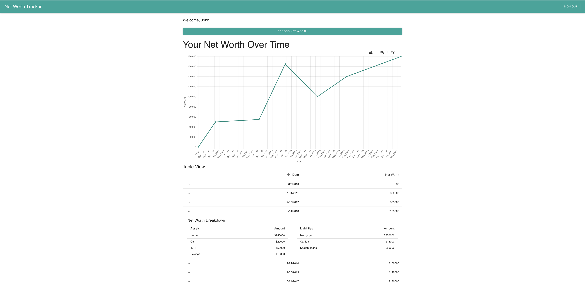

# Net Worth Tracker

Try it out: https://jackagtual.github.io/Net-Worth-Tracker/

This app allows different users to track their net worth over time. The user can enter details about all their assets and liabilities over time to track how their net worth changes over time.

This applicaiton stores unique data for each user. The homepage of the app allows the user can sign in as an existing user or create a new user account.

After logging in or creating a new account, the user's net worth can be viewd in a Net Worth vs. Time graph and in a taular view. Each row in the net worht table can be expanded to see the composition of that specific net wroth entry.



## Technical Details

Utilized a modern tech stack featuring React, TypeScript, and Material UI for the frontend. The choice of Material UI ensured a sleek, fully responsive user interface, enhancing the overall user experience. Chart.js was used to display a plot of the user's net worth vs. time chart.

Firebase was integrated as the backend service to support user data persistence and real-time updates.

## Installation

After cloning the repo run the following npm commands:

```
npm i
npm run dev
```

## Future Work

- Allow user to edit and delete existing net worth entries
- Authentication with Google
